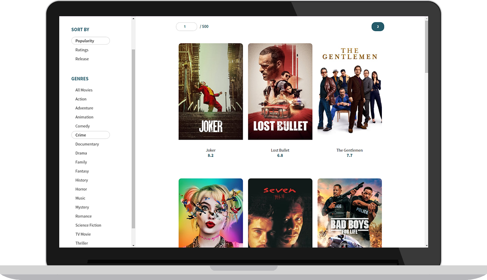
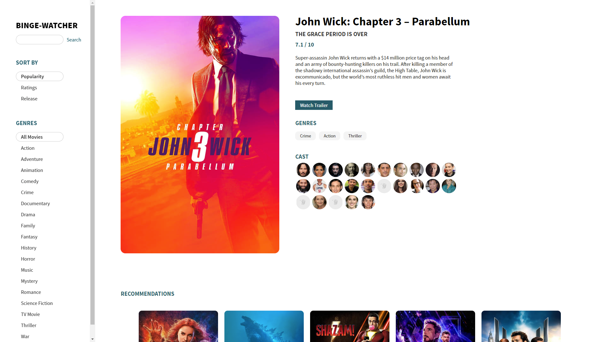
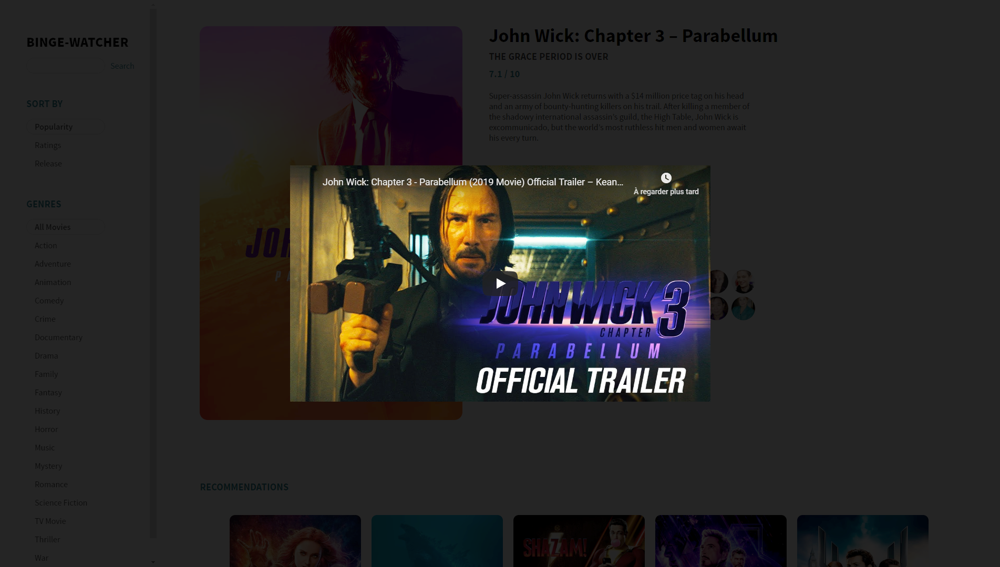
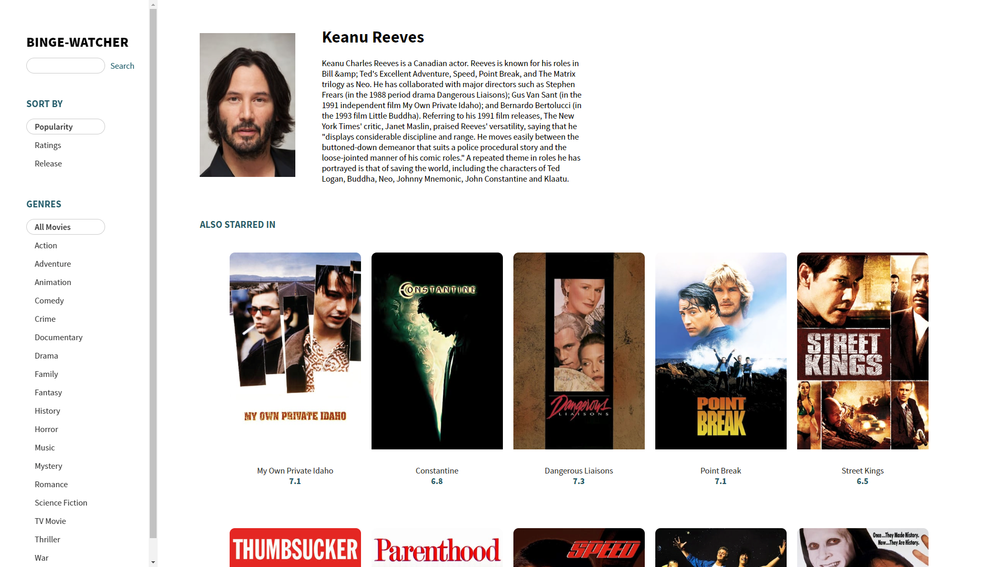

## 1. About

Binge Watcher is a React app based on The Movie Database. [Live Demo](https://binge-watcher.netlify.com)

  

  

Tech Stack:
- React
- Redux
- redux-thunk
- styled-components

## 2. Installation
- install dependencies with `npm install`.
- create an `.env.local` file in the root directory.
- inside, store your TMDb Api key : `REACT_APP_API_KEY=XXXXXXXXXXXX`

## 3. Usage
- `npm run start` or `yarn start` to run the app on your local machine.

      
### Check specific movies

  
### Watch Trailers

  
### Get informations on actors

